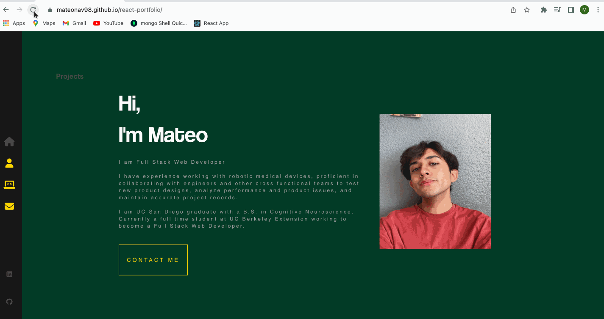

# React Portfolio

## Description
Portfolio built and designed using React. Webpage incudes an image of myself, an about me section, past projects, and my contact info. Intended to showcase my experience, work, and more about myself. Application is deployed through Github Pages.

Deployed link: https://mateonav98.github.io/

## Table of Contents
* [Installation](#installation)
* [Usage](#usage)
* [Gif Demo](#gif-demo)
* [Technologies Used](#technologies-used)
* [Contributors](#contributors)
* [License](#license)

## Installation
No Installation Required

## Usage

Navigate the page using the side nav bar to learn more about me and the projects I have done.  "About Me" section includes a description of my previous work and education experience. "My Projects" includes a gallery of past projects. Check out the deployed application or the GitHub repo. Feel free to reach out, using the info provided in the "Contact Me" section. You can find my phone number, email, as well as links to my GitHub and LinkedIn.

## Gif Demo

## Technologies Used

1. Javascript
2. CSS
3. React

## Contributors
* Mateo Navarro [LinkedIn](https://www.linkedin.com/in/mateonav/) | [GitHub](https://github.com/mateonav98)

## MIT License

Copyright (c) 2022 Mateo Navarro

Permission is hereby granted, free of charge, to any person obtaining a copy
of this software and associated documentation files (the "Software"), to deal
in the Software without restriction, including without limitation the rights
to use, copy, modify, merge, publish, distribute, sublicense, and/or sell
copies of the Software, and to permit persons to whom the Software is
furnished to do so, subject to the following conditions:

The above copyright notice and this permission notice shall be included in all
copies or substantial portions of the Software.

THE SOFTWARE IS PROVIDED "AS IS", WITHOUT WARRANTY OF ANY KIND, EXPRESS OR
IMPLIED, INCLUDING BUT NOT LIMITED TO THE WARRANTIES OF MERCHANTABILITY,
FITNESS FOR A PARTICULAR PURPOSE AND NONINFRINGEMENT. IN NO EVENT SHALL THE
AUTHORS OR COPYRIGHT HOLDERS BE LIABLE FOR ANY CLAIM, DAMAGES OR OTHER
LIABILITY, WHETHER IN AN ACTION OF CONTRACT, TORT OR OTHERWISE, ARISING FROM,
OUT OF OR IN CONNECTION WITH THE SOFTWARE OR THE USE OR OTHER DEALINGS IN THE
SOFTWARE.